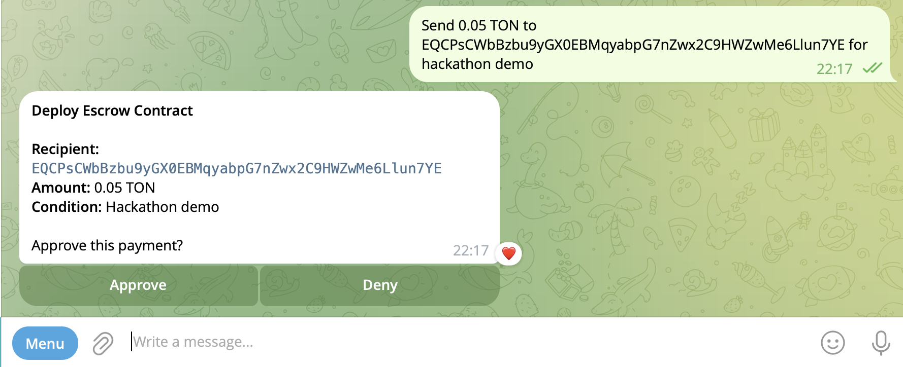
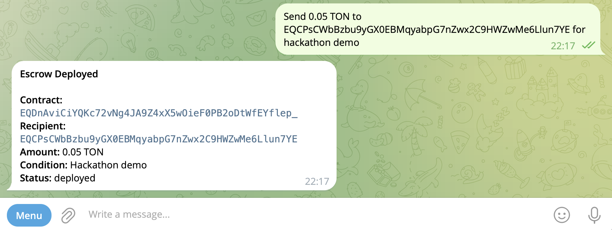
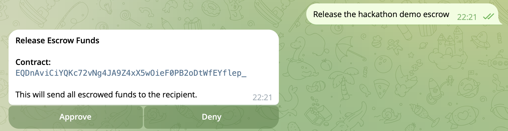
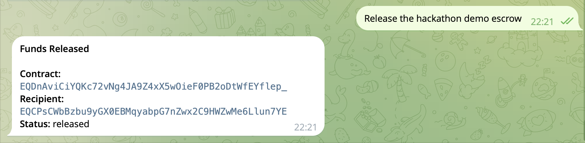

# Safe Pay Agent

**AI payment agent on Telegram that validates every transaction through a safety engine before executing on TON.**

## Problem

AI agents are getting access to money. They make mistakes — wrong amount, wrong recipient, no recourse. There's no safety layer between AI intent and on-chain execution.

## Solution

User chats naturally in Telegram. AI proposes the payment. [Validance](https://validance.io) validates, requires human approval, then executes an escrow contract on TON. The AI can propose but cannot execute without approval.

## Architecture

```
┌─────────────────────────────────────────────────────────────────┐
│  Telegram                                                       │
│  ┌───────────┐    "Send 0.5 TON to EQ... for coffee"           │
│  │   User    │─────────────────────┐                            │
│  └───────────┘                     ▼                            │
│                          ┌──────────────────┐                   │
│                          │  Grammy Bot      │                   │
│                          │  + Claude AI     │                   │
│                          └────────┬─────────┘                   │
│     [Approve] [Deny] [Remember]   │ structured proposal         │
│              ▲                    ▼                              │
│  ┌───────────┴──────────────────────────────────────────────┐   │
│  │  Validance Engine                                        │   │
│  │  ┌──────────┐ ┌───────────┐ ┌──────────┐ ┌───────────┐  │   │
│  │  │ Catalog  │→│Rate Limit │→│ Learned  │→│ Approval  │  │   │
│  │  │ Match    │ │ (3/hr)    │ │ Policy   │ │ Gate      │  │   │
│  │  └──────────┘ └───────────┘ └──────────┘ └─────┬─────┘  │   │
│  │                                                │         │   │
│  │  ┌──────────────┐    ┌─────────────────────┐   │         │   │
│  │  │ Secret Store │───→│ Isolated Container  │◄──┘         │   │
│  │  │ (mnemonic)   │    │ (ton-worker)        │             │   │
│  │  └──────────────┘    └──────────┬──────────┘             │   │
│  │          audit trail ◄──────────┘                        │   │
│  └──────────────────────────────────────────────────────────┘   │
│                                    │                            │
└────────────────────────────────────┼────────────────────────────┘
                                     ▼
                          ┌──────────────────┐
                          │  TON Blockchain  │
                          │  SafePayment     │
                          │  (deploy/release │
                          │   /refund)       │
                          └──────────────────┘
```

## Demo

[](https://youtu.be/NcPtu24QBPc)

## Full Escrow Lifecycle

> "Send 0.05 TON to EQ... for hackathon demo"

| Step | Screenshot |
|------|-----------|
| 1. AI parses intent, asks approval |  |
| 2. Contract deployed on TON |  |
| 3. User releases funds |  |
| 4. Funds sent to recipient |  |

*"Release the hackathon demo escrow" — the AI remembers the contract from context and routes the release to the correct address. That's the intelligence layer, not just a form.*

Contract on testnet: [`EQDnAviCiYQKc72vNg4JA9Z4xX5wOieF0PB2oDtWfEYflep_`](https://testnet.tonscan.org/address/EQDnAviCiYQKc72vNg4JA9Z4xX5wOieF0PB2oDtWfEYflep_)

## How to Run

```bash
git clone https://github.com/Wik-dev/safe-pay-agent && cd safe-pay-agent
npm install && npx blueprint build SafePayment
docker compose --profile build build ton-worker && docker compose up -d validance postgres
cd telegram-bot && npm install && cp .env.example .env
# Set TELEGRAM_BOT_TOKEN, ANTHROPIC_API_KEY, and VALIDANCE_URL (default: http://localhost:7500)
npx tsx --env-file=.env src/index.ts
```

## E2E Tests (no Telegram needed)

```bash
cd telegram-bot && npx tsx --env-file=.env tests/test_e2e.ts
# 24 tests: keyword filter, Claude extraction, deploy+approve, deny flow
```

## Features Beyond Basic Escrow

### Conversational AI
- **Chat history** — per-chat memory so Claude understands follow-ups ("release the coffee escrow" without re-specifying the address)
- **Markdown rendering** — Claude's responses render properly in Telegram (bold, code, italic)
- **Smart pre-filter** — keyword detection skips the Claude API call for irrelevant messages, saving latency and cost

### Multi-Action Support
- **Parallel tool calls** — "make 3 payments" produces 3 separate approval messages, each with independent Approve/Deny buttons
- Single-action and conversational flows work exactly as before

### Learned Policies
- **Approve + Remember** — a third button on every approval prompt that creates a learned policy rule
- Future matching proposals auto-approve based on learned rules — the engine learns your trust preferences
- `/policies` to inspect, `/reset_policies` to clear

### Validance Introspection Commands
Direct read-only queries to the safety engine — no AI involved:

| Command | What it shows |
|---------|--------------|
| `/status` | Engine health, database, loaded catalog |
| `/audit` | Tamper-evident audit trail (hashes, timestamps) |
| `/catalog` | Available actions, approval tiers, rate limits |
| `/policies` | Learned policy rules |
| `/reset_policies` | Clear all learned rules |
| `/contracts` | Active escrow contracts |

### Balance Check
- `ton_balance` action with optional address — omit to check the bot's own wallet

### Catalog-Driven Architecture
- Tools, keywords, system prompt, display formatting — all generated from `catalog/ton-payments.json`
- Adding a new action = one JSON entry + one worker script, zero bot code changes

## Tech Stack

Tact + Blueprint (smart contract) · Grammy (Telegram bot) · Claude Sonnet (intent extraction) · Validance (validated execution engine) · TON testnet

## What's Next

The safety engine is generic — same approval gates, rate limits, and audit trails scale to any complexity. Recurring payments, multi-step workflows, spending limits, multi-sig approval chains. Same engine, same safety, any complexity.

## License

MIT
